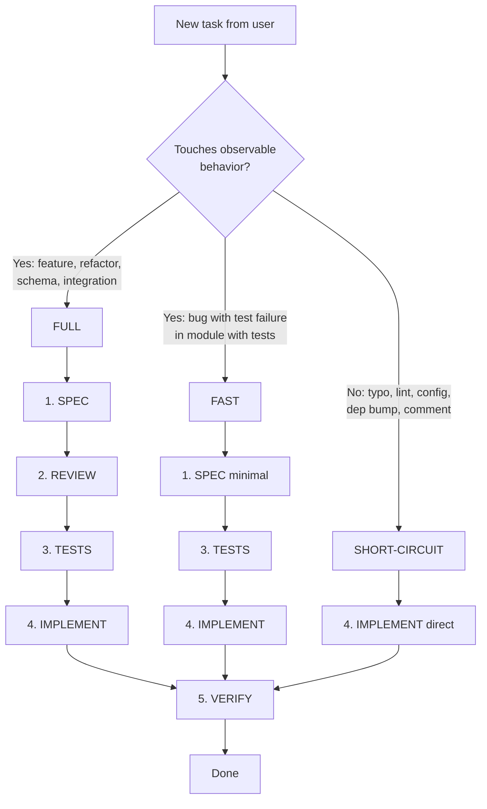

# SPEC_PIPELINE.md — Process

Process doc for the SDD pipeline. For philosophy and when to use the pipeline, see [AGENTS.md](./AGENTS.md).

---

## Flow



---

## Step 1 — SPEC

**Applies to**: FULL and FAST.

**Output path**: `specs/features/<area>/<slug>.spec.md`. Common areas depend on your domain (e.g. `auth/`, `billing/`, `api/`, `ui/`, `notifications/`).

**Template**: use `specs/templates/feature.spec.md` as base. DO NOT invent sections — if a section does not apply, write `N/A` with reason in one line.

**Prompt**: `specs/prompts/spec-generator.md`.

**Checklist before passing to review**:
- [ ] Spec path follows `specs/features/<area>/<slug>.spec.md`
- [ ] If there is a ticket, the spec references it (ID + link)
- [ ] Affected roles explicit
- [ ] Multi-tenant context covered (if applicable to your product)
- [ ] Migration impact documented if it touches schema or existing users
- [ ] Rollout plan if the feature is risky (feature flag, gradual rollout, kill-switch)
- [ ] ASSUMPTIONS marked explicitly in their section

**FAST mode**: minimal spec only needs Context + Validation Rules + Edge Cases + Errors. Skip Roles/Multi-tenant/Migration if the feature is already specified elsewhere and you are only refining.

---

## Step 2 — REVIEW

**Applies to**: FULL.

**Prompt**: `specs/prompts/spec-reviewer.md`.

**Output**: edit the same `<slug>.spec.md` with `## Review notes` section at the end, listing issues found and resolutions taken.

**Reviewer checklist**:
- [ ] Multi-tenant edge cases covered? (if applicable)
- [ ] External integration failure modes considered?
- [ ] Migration plan does not assume consistent DB when prod is not?
- [ ] Backwards-compat for existing users? If breaking, deprecation timeline?
- [ ] Testing strategy aligned with Selective TDD?
- [ ] Applicable skill identified?
- [ ] New architectural decision? If yes, write ADR in `docs/adr/`

**FAST/SHORT-CIRCUIT mode**: skip formal review. Review happens in commit message or PR description.

---

## Step 3 — TESTS

**Applies to**: FULL and FAST. SHORT-CIRCUIT skips unless the change is in module with existing tests (then update tests in same commit).

**Prompt**: `specs/prompts/test-generator.md`.

**Selective TDD applied** (from AGENTS.md):

| Type of change | Action |
|---|---|
| Service / util / business logic | Test-first — write failing test, then implement |
| Endpoint / API handler | Test-first — define request/response shape, then implement |
| Bug fix | Failing-test-first — reproduce the bug in test, then fix |
| Hook / util / lib | Test-first |
| UI component / page | Code-first — implement, add tests if reusable logic |
| Any change in tested module | Update tests in same commit |

**Setup**: depends on your stack. Document in `AGENTS.md` the test runner, fixtures location, async patterns, and any polyfills/mocks used.

---

## Step 4 — IMPLEMENT

**Applies to**: all modes.

**Prompt**: `specs/prompts/implementation.md`.

**Rules**:
- Respect your project architecture (documented in AGENTS.md)
- Do not introduce logic outside the spec — if you find an unspecified case, mark `// TODO(spec): <question>` and stop. Ask spec author.
- Vigent ADRs are ground truth — do not contradict without writing a new ADR
- Conventions in AGENTS.md are mandatory

**If you find drift between spec and reality**: update the spec in the same commit. Do not let code and spec diverge.

---

## Step 5 — VERIFY

**Applies to**: all modes. This is the gate before claiming "done".

**Recommended skill**: see [`AGENTS.md` §Available Skills](./AGENTS.md#available-skills) (VERIFY stage). The companion skill, if installed, automates this gate; otherwise apply the checklist below.

**Mandatory checklist**:
- [ ] Tests of the affected module pass locally
- [ ] Lint clean
- [ ] Changes committed and pushed
- [ ] CI green (wait before continuing)
- [ ] If UI changed: smoke test manually or with browser automation
- [ ] If DB schema changed: migration tested locally (up + down + idempotence)
- [ ] If external integration: tested with sandbox/staging of the provider

**No claim "done" without evidence.** The companion verification skill (when installed) requires showing the actual command output; the embedded fallback applies the same standard manually.

---

## Storage convention

```
specs/
├── templates/
│   └── feature.spec.md          # canonical template
├── prompts/
│   ├── spec-generator.md
│   ├── spec-reviewer.md
│   ├── test-generator.md
│   └── implementation.md
└── features/
    ├── README.md                # convention docs
    ├── <area>/
    │   └── <slug>.spec.md
    └── ...
```

**Rules**:
- One spec per feature, lives in repo (versioned with code)
- Path slug in kebab-case, descriptive
- If a spec becomes obsolete, do not delete it: mark `## Status: deprecated` with reason and replacement
- ADRs live separately in `docs/adr/` (architectural decisions, not specs)

---

## Examples per mode

### FULL (new feature)
> "Implement installment payments via Stripe"

1. Spec in `specs/features/billing/installment-payments.spec.md` with all sections (includes multi-tenant if applicable, migration impact, rollout plan)
2. Formal review with ADR if it introduces a new billing pattern
3. Tests-first for `paymentService.createInstallmentCharge()` + endpoint
4. Implementation following project architecture
5. Verify: tests + lint + CI + smoke in Stripe sandbox staging

### FAST (bug fix)
> "Reset password rejects expired tokens with message 'Token expired' instead of 'Token invalid'"

1. Minimal spec in `specs/features/auth/reset-password-error-message.spec.md`: Context (UX clarity) + Errors (exact message). 15 lines.
2. Skip formal review (PR description sufficient)
3. Failing test reproducing the old message, then fix
4. Change in service file
5. Verify: test pass + lint + CI

### SHORT-CIRCUIT (typo)
> "Fix typo in pricing page"

1. Skip spec
2. Skip review
3. Skip new tests (existing tests should still pass)
4. `sed -i` the typo or manual edit
5. Verify: lint + existing tests pass

---

## When to escalate to a planning skill

For non-trivial tasks (>1 day estimated, multi-file, non-obvious side effects), use the planning companion skill **before** Step 1 — see [`AGENTS.md` §Available Skills](./AGENTS.md#available-skills) (Pre-SPEC planning stage). The resulting plan feeds the SPEC with much better context. If no planning skill is installed, outline the scope in 5-10 bullets with the user before drafting the spec.
